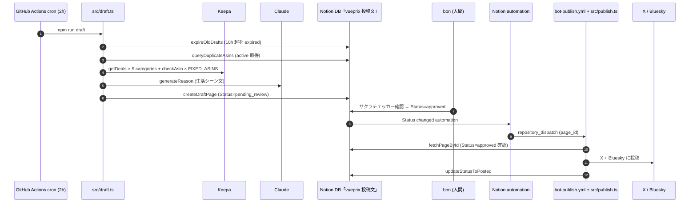

# vueprix

Amazon 値下がり情報を「食・健康・生活の質 + ガジェット」テーマに特化して X (@vueprix) と Bluesky (vueprix.bsky.social) に投稿する価格アラート bot。

サクラレビュー混入を防ぐため、投稿は **Notion 上での人間承認を経由** する 2-stage pipeline で運用する (詳細: [ADR-002](docs/adr/002-notion-approval-flow.md))。

## アーキテクチャ



## カテゴリ

| Notion `カテゴリ` | Keepa root ID | 商品ジャンル |
|---|---|---|
| `food` | 57239051 | 食品・飲料・お酒 |
| `health` | 160384011 | ドラッグストア |
| `pc-desk` | 2127209051 | パソコン・周辺機器 |
| `gaming` | 637394 | ゲーム |
| `audio` | 3477981 | イヤホン・ヘッドホン本体 |
| `fixed-list` | (n/a) | `src/config.ts` の `FIXED_ASINS` |

カテゴリ ID 検証: `npx tsx scripts/verify-keepa-categories.ts <id1> <id2> ...` (詳細: [docs/notes/keepa-categories.md](docs/notes/keepa-categories.md))

## Scripts

| コマンド | 説明 |
|---|---|
| `npm run draft` | Keepa から候補を取得し、Notion DB に Status=pending_review として書き込む (cron 2h で実行) |
| `npm run publish -- --page-id <id>` | 指定 page_id の approved 候補を X/Bluesky に投稿し、Status=posted に更新 (Notion automation の repository_dispatch から起動) |
| `npm run typecheck` | `tsc --noEmit` |
| `npm run lint` | `eslint . --max-warnings=0` |
| `npm test` | vitest 全 spec 実行 |

## 運用フロー

1. **cron (2h)**: `bot.yml` (`vueprix-draft`) → `npm run draft` → Notion DB に pending_review が積まれる
2. **bon の確認 (10h 以内)**: Notion DB の各 row でサクラチェッカー URL を押して確認 → Status を `approved` / `rejected` / そのまま (10h で expired) のいずれかに変更
3. **Notion automation**: Status = approved の変更を検知 → GitHub `repository_dispatch` で `event_type=vueprix-publish` を発火
4. **bot-publish.yml**: `repository_dispatch` を受信 → `npm run publish -- --page-id <id>` → Notion から投稿文を取得 → X / Bluesky に投稿 → Status=posted

GitHub PAT 設定など Notion 側の構成手順は [docs/notes/notion-approval-flow.md](docs/notes/notion-approval-flow.md) を参照。

## ローカル開発

```bash
cp .env.example .env
# .env に各種 API キーを記入

# draft 実行 (Notion DB に Status=pending_review を書き込む。実投稿は bon が approved にした後 bot-publish 経由でのみ走る)
npm run draft
```

> `DRY_RUN` 環境変数 / `DryRun` checkbox property は PR-8 で廃止。Status guard (`fetchPageById` の approved check + 投稿日時セット済 page の early return) のみで二重投稿を防ぐ本番一本化に変更した。承認済みの page のみが publish 対象になるため、本番接続前の試運転は Notion DB を直接見て pending_review row が作成されることで確認する。

## 設計ドキュメント

- [ADR-001: Project Foundation](docs/adr/001-project-foundation.md) — 初期 tech stack と scope
- [ADR-002: Notion Approval Flow](docs/adr/002-notion-approval-flow.md) — 2-stage pipeline / ガジェットカテゴリ / posted.json 廃止
- [ADR-005: PA-API 廃止 + Notion platform 別 status 連携](docs/adr/005-paapi-removal-and-platform-status.md) — Keepa 単一 source 化 / per-platform checkbox / silent loss 解消
- [docs/notes/notion-approval-flow.md](docs/notes/notion-approval-flow.md) — Notion automation + GitHub PAT 設定手順
- [docs/notes/keepa-categories.md](docs/notes/keepa-categories.md) — Keepa category ID 検証ログ
